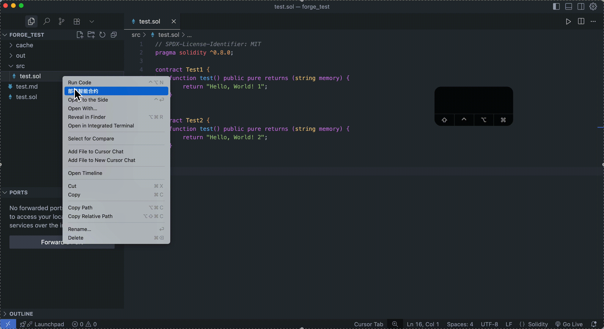
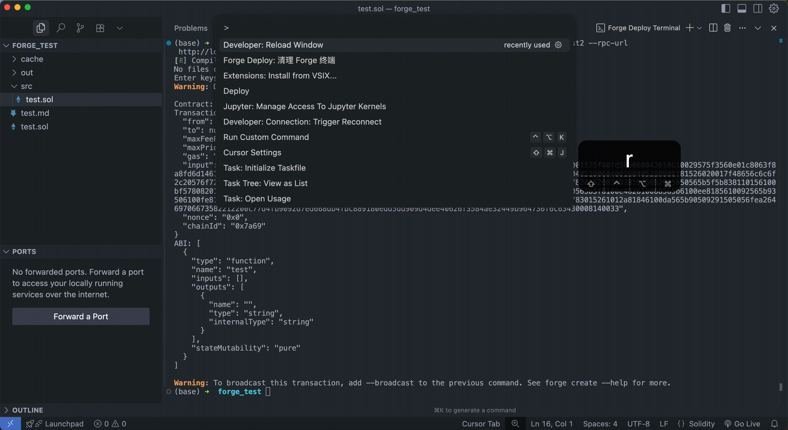

<!--
 * @Author: Mr.Car
 * @Date: 2025-07-17 22:11:47
-->
# Forge Commander VSCode Extension

*是不是被“forge create 每次都要输入`合约文件的名称`和`合约名`”烦死了？让Forge Commander 来拯救你！*

**只需要右键单击合约文件！就可以点几下鼠标部署合约！还支持 `--broadcast`，`--verify` 等功能**

**这个插件有如下优点：**
1. 自动扫描合约文件中的类名，省去了forge create 时候还要自己手敲合约名的麻烦。
2. 支持选择部署网络，默认配置中支持local（anvil 本地网络）sepolia（11155111 测试网）还有用户自定义网络。
3. 支持自动扫描cast wallet 账户（好吧，目前只支持这一个方式，未来请看看我们的`todolist`）点一点就可以选择部署用的账户
4. forge commander 本质上只帮助你将鼠标点击转换成`shell命令`，这个命令的内容完全由你自己控制，非常安全，所见即所得!
---

## 面向用户

- 一键部署 Solidity 智能合约到 Sepolia、Local 或自定义网络
- 支持合约自动验证（--verify）、广播（--broadcast）等选项
- 右键 .sol 文件，选择“部署智能合约”即可
- 自动识别合约、账户、网络，交互式参数输入

### 安装方法

1. 从 [VSCode 插件市场](https://marketplace.visualstudio.com/vscode) 搜索并安装 `forge-commander`。
2. 或者下载 `.vsix` 文件后，在 VSCode 或者 Cursor命令面板中运行 `Extensions: Install from VSIX...` 选择本地文件安装。

3. 安装后 reload 你当前的编辑器。使用过程中出现任何问题，reload 一下，基本都可以解决！
 

---

## For Developers

- Node.js 版本要求：**>=18.x**
- 推荐包管理工具：**pnpm**（也可用 npm/yarn）
- TypeScript + VSCode API 开发
- 支持本地调试（F5）、热重载（pnpm run watch）
- 主要入口：`src/extension.ts`

### 项目本地测试

1. 安装依赖：`pnpm install`
2. 编译项目：`pnpm run compile`
3. 按 F5 启动 VSCode 扩展开发主机进行本地调试
> owner 打包: `pnpx vsce package`
> owner 部署: `pnpx vsce publish`
> owner 录制gif: `ffmpeg -i <install.mov> -vf "setpts=0.5*PTS,fps=8" -c:v gif -f gif <install.gif>`

如需要提交BUG修改或新特性开发，请通过 Pull Request（PR）方式提交。

---

## Changelog

### 0.0.3
- 初始版本：支持一键部署合约、账户/网络/参数交互选择、合约验证和广播选项
- 完善文档
- 支持 .github workflow CICD

---

## ToDo List

- [ ] 中英文双语文档
- [ ] 国际化（i18n）支持
- [ ] 合约部署历史记录留存
- [ ] 能够自行配置rpc-url等关键参数
- [ ] 扩展目前 keystore 账户的管理方式，增加 secrect-key 的支持
- [ ] 扩展 test 和 script